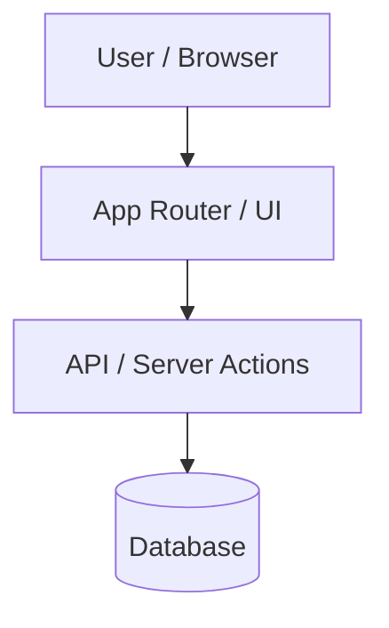
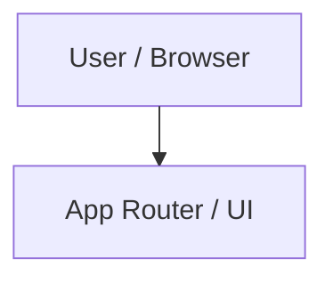
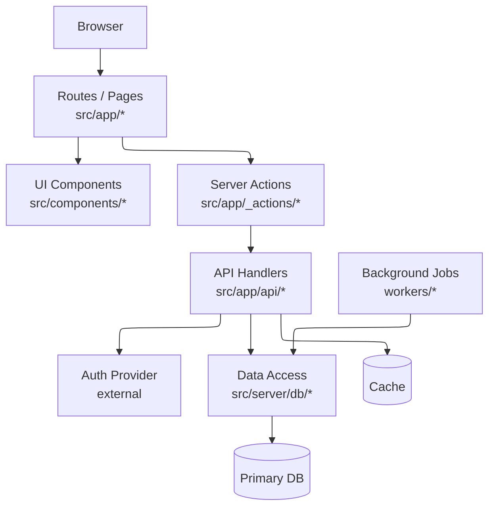

# Better Diagram

## Overview

Use Mermaid with ELK layout for large architecture and dependency diagrams. Optimize for rendered readability first, not for shortest source text.

The target output is a useful architecture map, not a simplified toy diagram. For repository architecture requests, prefer a high-level but concrete view that names real subsystems, runtime boundaries, external services, stores, entrypoints, and key repo-relative paths.

## GitDiagram-Compatible Output

When the target is GitDiagram or a GitDiagram-style renderer, follow the way GitDiagram actually renders diagrams:

- GitDiagram registers `@mermaid-js/layout-elk` in the React renderer and initializes Mermaid with `flowchart.defaultRenderer = "elk"`, `curve = "linear"`, `nodeSpacing = 50`, `rankSpacing = 50`, and `padding = 15`.
- GitDiagram's compiler emits plain `flowchart TD`. Do not rely on Mermaid frontmatter there; the renderer supplies ELK.
- GitDiagram graph limits are tight: at most 34 nodes, 48 edges, 10 groups, 72 characters for labels and types, and 240 characters for descriptions.
- Groups become visible Mermaid `subgraph` boxes and also drive tone classes. For the cleanest map, use `groups: []` unless visible group boxes are worth the added layout constraints.
- Every node becomes `node_<id>` in Mermaid. Use stable lowercase snake_case IDs so compiled source stays readable.
- Node text is rendered as `label`, optional short `type`, and optional `[filename]` from `path`, joined with ` `.
- Generic or long node types are hidden. Keep `type` short, repo-specific, and under four words if it should appear.
- File hints appear only for exact file paths whose basename is 18 characters or shorter. Directory paths remain clickable but do not display as `[filename]`.
- Edge labels render inline and add clutter. Prefer `label: null` for dense architecture maps.
- Valid paths must exactly match the repository file tree. Use `path: null` when the node represents an external service, managed infrastructure, or a conceptual pipeline stage.

## GitDiagram Screenshot Style

For a high-level architecture diagram that should look like GitDiagram's own output:

- Use a flat `flowchart TD` with no Mermaid frontmatter and no visible subgraphs.
- Put the main backend/server pipelines on the first row. If there are two implementations of one capability, put them side by side at the top.
- Put shared upstream dependencies on the second row: repository metadata/API, quota/cache, AI/model provider, validation/planning.
- Put the validation-to-artifact chain as a mostly vertical lane on the right: graph validation, Mermaid compile/validation, artifact storage, browse index, browse page.
- Put the product UI as a lower-left lane: app router UI, repo page, server actions, hooks, renderer, client API.
- Let the two top pipelines fan out directly to the shared service row. This creates the clean GitDiagram look with parallel vertical drops and short orthogonal elbows.
- Prefer direct edges over too many artificial aggregator nodes. Add an intermediate hub only when a fan-out creates visibly bad curved side exits.
- It is acceptable for long edges to route around the outside of the graph when they represent feedback or cached-state paths; keep the main read path vertical.
- Keep labels compact and similar in size: usually two lines, occasionally three lines for central pipeline nodes.
- Use the screenshot topology before inventing a new layout.

## Workflow

1. Gather structure from the repo before drawing:
   - Identify entrypoints, routes, package boundaries, services, data stores, external integrations, and build/runtime paths.
   - Prefer `rg --files`, manifests, config files, route directories, and dependency declarations over guessing from filenames alone.
   - Read enough code to distinguish runtime paths that look similar, such as frontend route handlers versus a separate backend service.
   - For project architecture diagrams, include the major components and critical flows plus one useful layer of implementation detail.

2. Choose diagram shape:
   - Use `flowchart TB` for layered systems, request lifecycles, build pipelines, and backend architecture.
   - Use `flowchart LR` for short linear flows, command chains, or client-to-service paths.
   - For the cleanest repo architecture maps, prefer a flat ELK graph with ownership/path hints inside node labels instead of visible Mermaid subgraph boxes.
   - Use subgraphs only when they materially improve the rendered layout or when the user explicitly asks for grouped boxes.
   - If using subgraphs, keep any single subgraph to about 5-9 nodes when possible. Split dense areas into nested or sibling subgraphs.
   - When a repo has parallel implementations of the same capability, show both as separate nodes or subgraphs instead of merging them. For example, show a Next.js generation pipeline separately from a FastAPI generation pipeline.

3. Use ELK renderer configuration:

If that frontmatter is not supported by the target renderer, use Mermaid init config instead:

4. Make the graph renderable:
   - Use stable lowercase node IDs and quoted labels: `api_routes["API Routes"]`.
   - Prefer short labels. Put file paths in small labels only when they clarify ownership.
   - Include repo-relative path hints in node labels for important components, routes, services, hooks, storage modules, validators, or entrypoints.
   - Format labels as two or three short lines when useful: component name, then path or responsibility.
   - Put visually related nodes near each other in the source order. With ELK, source order still helps produce cleaner ranks.
   - Create strong vertical layers: entrypoints, UI/client, server/backend pipelines, validation/transforms, storage, external systems.
   - Avoid long edge labels. If needed, use one or two words such as `reads`, `writes`, `calls`, `emits`.
   - Prefer no edge labels for dense architecture maps. Let node labels carry meaning.
   - Avoid crossing-heavy many-to-many edges. Introduce aggregator nodes such as `events["Event Bus"]` or `shared["Shared Utilities"]`.
   - Do not model every import. Group repeated leaves by subsystem.
   - Use database cylinder nodes for stores and regular rectangles for code modules.
   - Show external APIs and managed infrastructure explicitly when they shape the architecture, such as GitHub API, model providers, object storage, Redis, queues, or auth providers.
   - For UI-heavy apps, include the main user-facing pages and the hooks/client APIs that connect them to backend flows when those are central to the product.
   - If arrows cross badly, first remove subgraphs, then reorder node declarations by visual rank, then reduce shared cross-layer edges.
   - For GitDiagram-style compiled graphs, place nodes in the exact order you want ELK to consider them: top rank first, then second rank, left-to-right within each rank, then lower ranks.
   - Keep shared dependency nodes on one rank. Avoid placing shared services between two parallel pipelines if both pipelines need to point into them from opposite sides.
   - Prefer parallel edge bundles over diagonal crisscrossing. Put nodes with the same upstreams or downstreams in the same source-order row, and connect them in the same left-to-right order from each upstream.
   - When two pipelines call the same services, declare both pipeline nodes on one row, declare the shared services on the next row, then emit edges pipeline-by-pipeline in the same service order.
   - Prefer straight vertical edges for parent-to-child flows. Put a node's primary child directly after it in source order and avoid placing unrelated siblings between them.
   - For fan-out from a storage or service node, put all immediate children on the next row directly beneath it. If one child continues downward, place that continuing child in the center so its outgoing edge can stay vertical.
   - Avoid long side-exit edges from cylinder/database nodes when they visibly degrade the layout. If a store feeds multiple consumers and the edges curve badly, add a rectangular access/index node below the store, then fan out from that node.

5. Verify visually when possible:
   - Render the Mermaid diagram in the target environment or an available local/browser preview.
   - Check for clipped content, overlapped labels, unreadable edge bundles, excessive scrolling, or blank output.
   - If the render is poor, adjust graph structure before adding styling. Split subgraphs, shorten labels, reverse direction, or introduce intermediate nodes.

## Repair Rules

- If the diagram is tangled, reduce edge count before changing styles.
- If the diagram is too wide, switch from `LR` to `TB` or split into two diagrams.
- If nodes overlap or edges route through labels, force ELK and simplify subgraphs.
- If the renderer ignores ELK, preserve a valid non-ELK Mermaid fallback and tell the user the target renderer may not support ELK.
- If the diagram is still too large, produce a high-level diagram plus one focused detail diagram rather than one unreadable mega-diagram.

## Output Pattern

For architecture requests, return:

1. A brief note about what the diagram covers.
2. The Mermaid block with ELK config, unless the target renderer is GitDiagram where plain `flowchart TD` is expected.
3. Any important omissions or assumptions.

Keep prose short. The diagram is the artifact.

## Architecture Map Style

For a repo-level architecture map:

- Use 12-28 nodes by default. Go smaller only when the repo is genuinely simple.
- Prefer component labels that combine purpose and ownership, such as `Generation Pipeline src/server/generate/*`.
- Keep node labels readable: short phrases, line breaks, and no long sentences.
- Make the top-to-bottom flow tell the story: user entrypoints, UI/client layer, server or backend pipeline, validation/transforms, storage, external systems.
- Prefer flat diagrams for first-pass architecture maps. Use labels, spacing, and source order before adding visible group boxes.
- For a clean GitDiagram-like map, avoid subgraphs, avoid edge labels, use similarly sized nodes, and arrange source order by rows.
- To encourage parallel lines, align sibling nodes into rows and keep fan-out/fan-in edge declarations ordered consistently across those rows.
- Avoid inventory diagrams. Do not include tests, tiny utilities, styling files, generated files, or config unless they define a real runtime boundary.
- If the first render would be too dense, split into a high-level diagram plus one focused detail diagram rather than removing all useful detail.

## Clean Layout Recipe

When a diagram still looks tangled:

1. Remove visible subgraphs and set all grouping to labels or types.
2. Reduce many-to-many edges by introducing a small shared node such as `generation_services`, `storage_layer`, or `external_apis`.
3. Keep each parallel pipeline mostly vertical. Merge only after both pipelines reach a common validation, artifact, or storage stage.
4. Put broad fan-out nodes above the nodes they fan out to, not in the middle of the graph.
5. For repeated edges, use the same target order from each source so ELK can route them as parallel bundles.
6. If an edge curves around another node, move the target directly below the source or introduce an intermediate node that owns the fan-out.
7. Prefer two short diagrams over one diagram with long side-to-side return edges.

## Example

