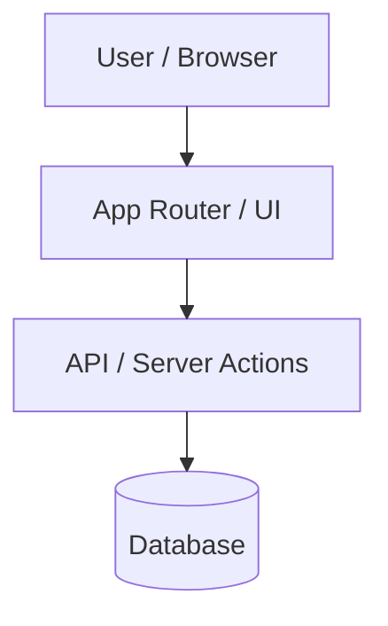
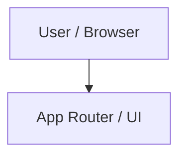
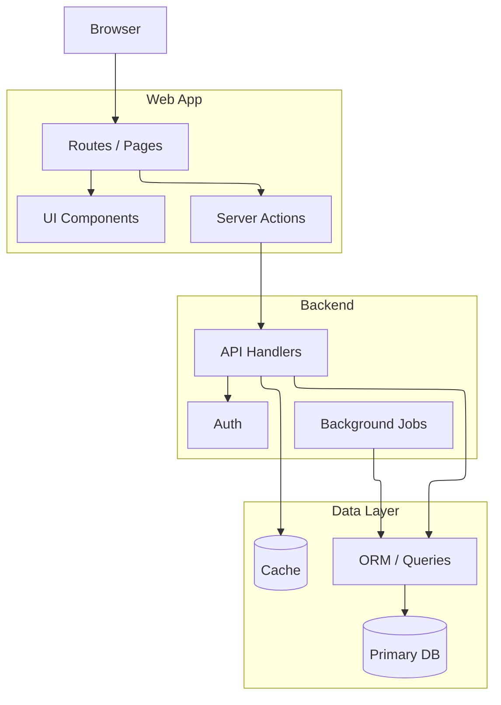

# Better Diagram

## Overview

Use Mermaid with ELK layout for large architecture and dependency diagrams. Optimize for rendered readability first, not for shortest source text.

## Workflow

1. Gather structure from the repo before drawing:
   - Identify entrypoints, routes, package boundaries, services, data stores, external integrations, and build/runtime paths.
   - Prefer `rg --files`, manifests, config files, route directories, and dependency declarations over guessing from filenames alone.
   - For project architecture diagrams, include only the major components and critical flows unless the user asks for exhaustive detail.

2. Choose diagram shape:
   - Use `flowchart TB` for layered systems, request lifecycles, build pipelines, and backend architecture.
   - Use `flowchart LR` for short linear flows, command chains, or client-to-service paths.
   - Use subgraphs for ownership boundaries: app, API, background jobs, data, external systems.
   - Keep any single subgraph to about 5-9 nodes when possible. Split dense areas into nested or sibling subgraphs.

3. Use ELK renderer configuration:

If that frontmatter is not supported by the target renderer, use Mermaid init config instead:

4. Make the graph renderable:
   - Use stable lowercase node IDs and quoted labels: `api_routes["API Routes"]`.
   - Prefer short labels. Put file paths in small labels only when they clarify ownership.
   - Avoid long edge labels. If needed, use one or two words such as `reads`, `writes`, `calls`, `emits`.
   - Avoid crossing-heavy many-to-many edges. Introduce aggregator nodes such as `events["Event Bus"]` or `shared["Shared Utilities"]`.
   - Do not model every import. Group repeated leaves by subsystem.
   - Use database cylinder nodes for stores and regular rectangles for code modules.

5. Verify visually when possible:
   - Render the Mermaid diagram in the target environment or an available local/browser preview.
   - Check for clipped content, overlapped labels, unreadable edge bundles, excessive scrolling, or blank output.
   - If the render is poor, adjust graph structure before adding styling. Split subgraphs, shorten labels, reverse direction, or introduce intermediate nodes.

## Repair Rules

- If the diagram is tangled, reduce edge count before changing styles.
- If the diagram is too wide, switch from `LR` to `TB` or split into two diagrams.
- If nodes overlap or edges route through labels, force ELK and simplify subgraphs.
- If the renderer ignores ELK, preserve a valid non-ELK Mermaid fallback and tell the user the target renderer may not support ELK.
- If the diagram is still too large, produce a high-level diagram plus one focused detail diagram rather than one unreadable mega-diagram.

## Output Pattern

For architecture requests, return:

1. A brief note about what the diagram covers.
2. The Mermaid block with ELK config.
3. Any important omissions or assumptions.

Keep prose short. The diagram is the artifact.

## Example

